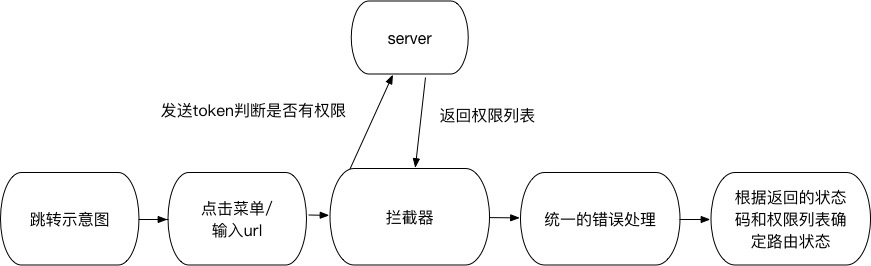

# show-v2.0
## 项目启动前需要安装
node, yarn, vue/cli, typescript, tslint, 默认ide webstorm
## Project setup 初始化项目
```
yarn install
```

### Compiles and hot-reloads for development  开发时启用本地服务器
```
yarn run serve
```

### Compiles and minifies for production 部署前打包
```
yarn run build
```

### Lints and fixes files 测试格式是否正确
```
yarn run lint
```

### Run your unit tests  单元测试
```
yarn run test:unit
```

### Run your end-to-end tests 端对端测试 e-to-e
```
yarn run test:e2e
```
### 技术选型及组件规划


### 登录部分设计


### 跳转部分设计


### TODO
1. 集成部署shell 编写
2. 自动文档生成
3. 测试覆盖或者部署的工作流